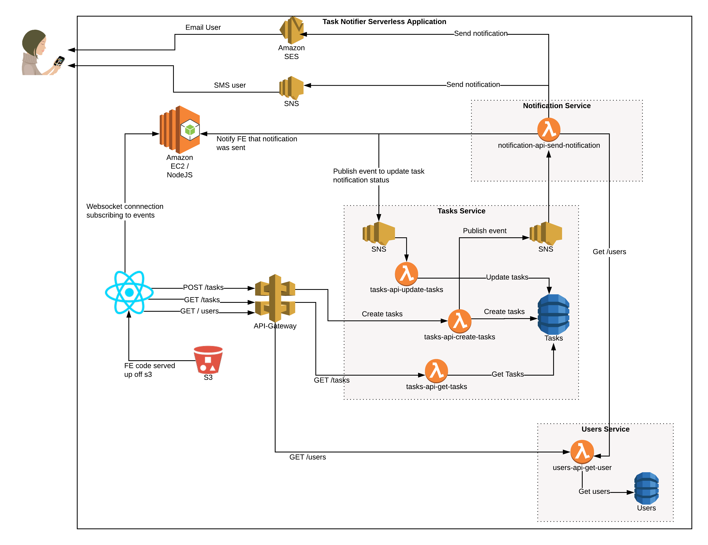
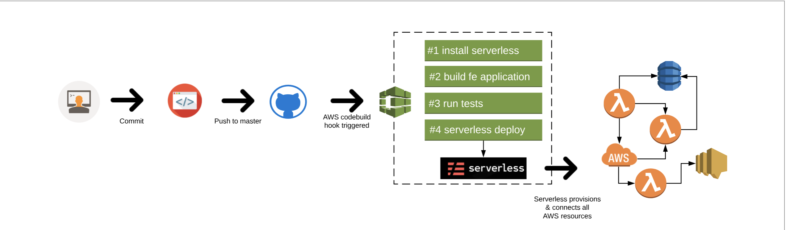

# Serverless Task Notification App


## Overview
**_Tast liks notification app_**  is a demo application designed to showcase the power of the [Serverless Framework](https://serverless.com) using popular Serverless technologies.
In this example, we utilize [aws](https://aws.amazon.com) as a Serverless provider.

The **Serverless Framework** is an open-source CLI for building and deploying serverless applications.

## Architecture
#### Technology Stack

**FE**:

* [React](https://reactjs.org/)
* [Material UI](https://material-ui.com/)
* [Storybook](https://storybook.js.org/)

**Backend**:

* [Serverless Framework](https://serverless.com)
* [AWS](https://aws.amazon.com)
    * EC2 / Node Js / Socket.io webscocket connections
    * Lambda
    * Api gateway
    * SNS
    * SES
    * Dynamo DB
    * Codebuild


[//]: <> (Make sure to update this diagram if needed, or change to lucidchart image link)


## CI/CD Workflow

[//]: <> (Make sure to update this diagram if needed, or change to lucidchart image link)


## How to run?

#### Installing the _Serverless Framework_
**Installing Node.js**

Serverless is a Node.js CLI tool so the first thing you need to do is to install Node.js on your machine.
Visit [Node.js](https://nodejs.org/en/) official page for intallation on your local machine.

**Installing the Serverless Framework**

Serverless Framework is installed via npm which was already installed when you installed Node.js.

Open p a terminal and type the following command:
```
npm install -g serverless
```

Once the installation process is done, you can verify that _Serverless_ was installed successfully by checking the current version by running:
```
serverless --version
```

**Setting up AWS**

The Serverless Framework needs access to your cloud provider's account so that it can create and manage resources on your behalf.
See the original [Serverless documentation AWS - Credentials](https://serverless.com/framework/docs/providers/aws/guide/credentials/) for more details.


Make sure you have the right AWS access key and secret key set!

**Deploying **_Serverless-task-notification_***

Install & Deploy (Installation script for serverless is provided to assure that Serverless is installed):

```bash
bash scripts/install.sh
bash scripts/deploy.sh
```

The scripts handle the installation of dependencies and deployment of the full API and FE application. To deploy a specific service, go into its directory and run `serverless deploy`
